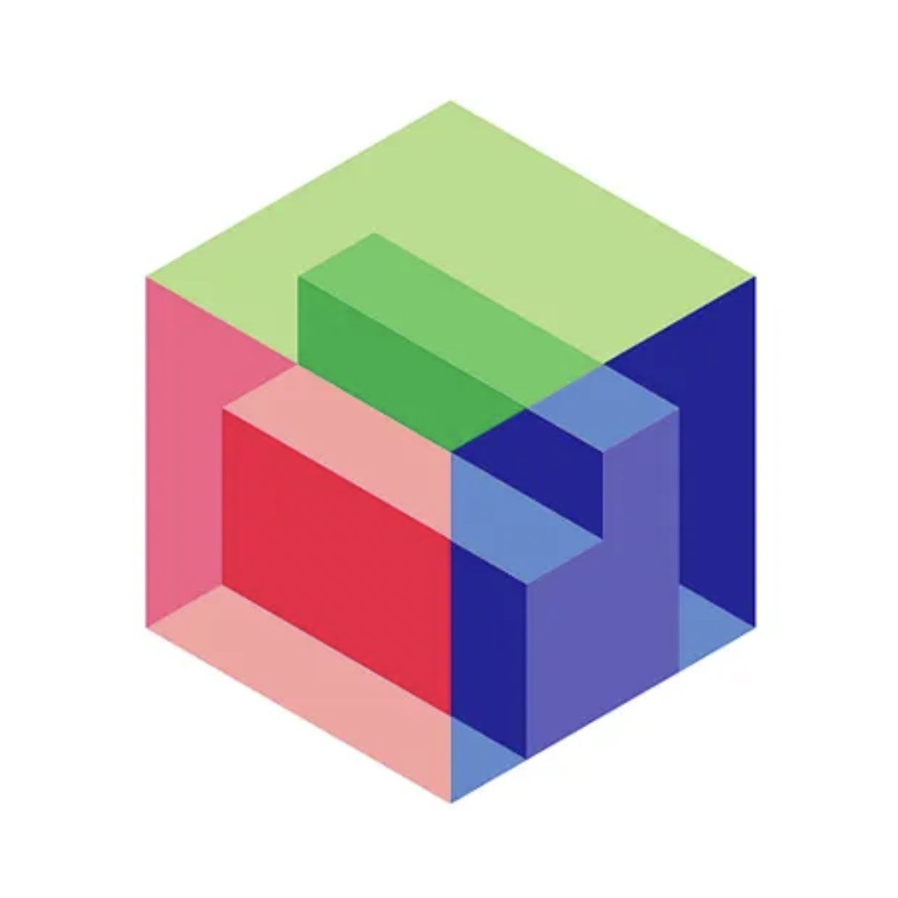

<div align="center">



# Dispatch

**A self-hosted, air-gapped issue tracker where MCP is a first-class interface for coding agents.**

[](https://github.com/iwandejong/dispatch/actions/workflows/ci.yml)
[](https://ghcr.io/iwandejong/dispatch)
[](LICENSE)

[Quick start](#quick-start) · [Connect an agent](#connect-a-coding-agent) · [MCP tools](MCP.md) · [Architecture](ARCHITECTURE.md) · [Security](SECURITY.md)

</div>

---

One Next.js app + PostgreSQL. No external services, no telemetry, no CDN, no remote fonts or images: it works with zero internet access.

## Features

- 📋 **Board and list views**, labels, relations, Markdown comments, per-issue activity
- ⌨️ **Command palette** (⌘/Ctrl + K), keyboard shortcuts (press `?`), PostgreSQL-backed search
- 🤖 **Built-in MCP server** at `http://localhost:15000/mcp` (20+ tools) and an [agent skill](skills/dispatch/SKILL.md)
- 🔍 **Traceability**: structured JSON logs on stdout plus an audit log of every UI and MCP change (Settings → Audit log)
- 👥 **No accounts.** Two fixed actors: **you** (the UI) and **the agent** (everything that arrives over MCP). Issues can be assigned to either

## Quick start

Requires Docker with Compose. A prebuilt image is published to `ghcr.io/iwandejong/dispatch`.

```sh
git clone https://github.com/iwandejong/dispatch.git && cd dispatch
./scripts/init-env.sh        # writes .env with a random database password
docker compose up -d
```

Open <http://localhost:15000>, create a project, and start filing issues.

Postgres lives on the internal compose network only (no host port), with a persistent `pgdata` volume and a health check. The app waits for it and applies migrations on start. No demo data is created.

> ⚠️ There is **no authentication**. The app is published on `0.0.0.0:15000`. See [SECURITY.md](SECURITY.md) before exposing it to a network.

## Connect a coding agent

```sh
claude mcp add --transport http dispatch http://localhost:15000/mcp
```

Then install the skill so the agent knows how to use the tools well:

```sh
ln -s "$PWD/skills/dispatch" ~/.claude/skills/dispatch
```

Details, other clients and the tool list: [MCP.md](MCP.md).

## Architecture

```
Browser ─┐                       ┌─ Server Actions ─┐
         ├─ Next.js (one app) ───┤                  ├─ lib/services/* ─ Prisma ─ PostgreSQL
Agent ───┘   UI · auth · /mcp    └─ MCP tools ──────┘
                                   └── audit + JSON logs
```

All business rules live in `lib/services/`; UI actions and MCP tools are thin adapters. See [ARCHITECTURE.md](ARCHITECTURE.md).

## Configuration

| Variable | Required | Purpose |
|---|---|---|
| `POSTGRES_PASSWORD` | yes | Database password (compose) |
| `DATABASE_URL` | set by compose | Postgres connection string |

## Logs and audit

- `docker compose logs -f app` shows one JSON line per operation: `ts, level, msg, requestId, source (ui|mcp), actor (HUMAN|AGENT), target, ok, error, durationMs`. Secret-looking argument keys are redacted and long text truncated.
- Every mutation and failed operation is also stored in the `AuditLog` table and shown under **Settings → Audit log**. Reads (search, get, list) are logged to stdout only.
- Per-issue history (status, assignee, priority, labels, comments) is under each issue's **Activity**.

## Data, backup, upgrade

- Data lives in the `pgdata` Docker volume. `docker compose down` keeps it; `docker compose down -v` **deletes it**.
- Backup: `docker compose exec -T postgres pg_dump -U dispatch dispatch > backup.sql`
- Restore into a fresh stack: `docker compose exec -T postgres psql -U dispatch dispatch < backup.sql`
- Upgrade: `git pull && docker compose up -d --build` (migrations run automatically on start).

## Limitations

Single-user by design (you + one agent, no accounts or permissions). Search uses PostgreSQL trigram indexes and is meant for thousands to tens of thousands of issues. Project pages load up to 200 issues. There is no realtime sync between browser tabs.

## Development, contributing, security

[DEVELOPMENT.md](DEVELOPMENT.md) · [CONTRIBUTING.md](CONTRIBUTING.md) · [SECURITY.md](SECURITY.md) · [MIT License](LICENSE)

